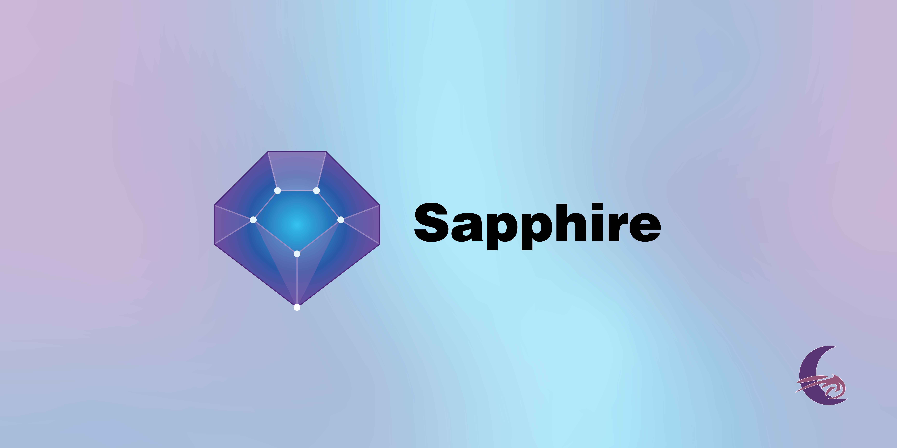

# Sapphire
 

  

  <strong>The only job search CRM you will ever need.</strong>

  
  
  

  <a href="https://nbi-project.fr/">Website</a>
  ·
  <a href="https://github.com/KoRIOz675/sapphire/releases/latest">Download</a>
  ·
  <a href="https://github.com/KoRIOz675/sapphire/issues">Report a Bug</a>
  ·
  <a href="https://github.com/KoRIOz675/sapphire/issues">Request a Feature</a>

---

## About
 
**Sapphire** is a desktop CRM built for job seekers. Keep every application, contact, and follow-up in one place — so you can focus on landing the job instead of managing spreadsheets.

Sapphire is NOT an open-source application, and therefore, this repository does NOT contain the source code of the application.

Built by [NBI Project](https://nbi-project.fr/).
 
## Features

- **People** — store contacts with role, department, phone, emails, circle of relation, direct manager, and referral sources (primary & secondary)
- **Companies** — track organisations with sector, size, headcount, priority, website, and parent-company relationships
- **Actions** — log every interaction (meeting, call, email…) with scheduled and completed dates, preparation notes, conclusion, and linked contacts
- **Projects** — group related work across multiple companies to manage job-search campaigns or any multi-company initiative
- **Dashboard** — see counts for all entities, contacts broken down by circle of relation, and quick-access lists of upcoming and recent actions
- **Local-first & private** — all data is stored in a local SQLite database; no account or internet connection required
- **Backup & restore** — configure an automatic backup folder with a retention policy and trigger backups on demand
- **Import / Export** — full JSON dump for backup or migration, plus per-entity CSV export for People, Companies, Actions, and Projects
- **Multilingual UI** — interface available in French and English, switchable at any time from Settings

## Roadmap
 
- [ ] Beta testing & feedback collection
- [ ] Bug fixes based on beta feedback
- [ ] Code signing (remove SmartScreen prompt)

Have an idea or found a bug? [Open an issue](https://github.com/KoRIOz675/sapphire-releases/issues) — feedback is welcome.

---

  Made with ❤️ by <a href="https://nbi-project.fr/">NBI Project</a>

  

